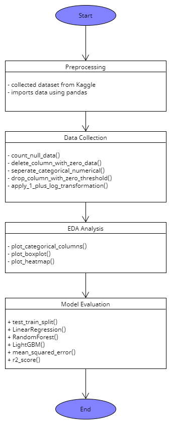

# Functional and non-function requirements of the project "Real Estate Price Analysis"

## Functional requirements:

1. Data Collection
   1. Collect data from Kaggle
   2. import the datasets using Pandas.

2. Preprocessing:
   1. Handle missing data, outliers, and categorical variables.
   2. Split the dataset into training and testing sets.

3. Exploratory Data Analysis (EDA):
   1. Provide statistical summaries of different variables.
   2. Generate visualizations such as boxplot, heatmap, and correlation matrices.

4. Model Evaluation:
   1. Evaluate the models using appropriate metrics such as Mean Square Error and R-Squared Score.
   2. Compare the performance of the three models

UML diagram:

## Non-Functional Requirements:

1. Usability:
   1. User-friendly, with clear instructions and outputs.

2. Performance:
   1. Efficiently handle large datasets.
   2. Provide fast response times during model training and prediction.

3. Reliability:
   1. Produce consistent and repeatable results across different runs.

4. Maintainability:
   1. Well-structured code and easy to understand.
   2. Easy to modify for future enhancements.

5. Documentation:
   1. All functions and modules should be well-documented.
   2. Provide a comprehensive user manual or guide.
